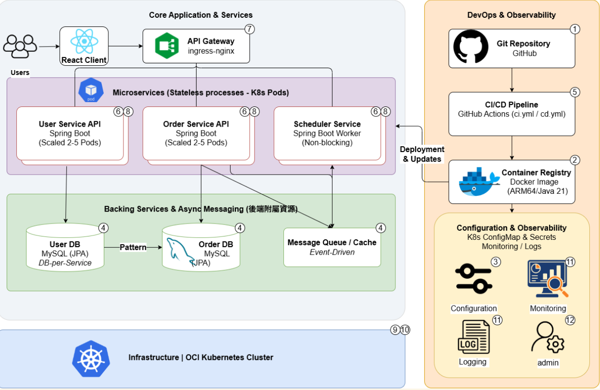

# Wafer 訂單管理排程系統（WOMS）

## 系統概述

半導體產業對晶圓（Wafer）的需求日益增長，其訂單管理與生產排程的效率至關重要。本系統為台積電雲原生期末專案，開發一套「Wafer 訂單管理與排程系統（WOMS）」，以取代人工排程作業，確保訂單能被合理安排生產。

系統主要負責工廠 Wafer 訂單的接收、管理與自動化排程，作為業務與生產規劃部門的核心工具。根據預設排程規則，系統智能地安排 Wafer 的生產日期，並在排程衝突時提供可視化說明。

---

## 快速啟動

> 前端本機開發需使用 Node.js 20+

### 需求
- [Docker Desktop](https://www.docker.com/products/docker-desktop/)（確認右下角圖示正在執行）

### 第一次啟動（或重置資料庫）

```bash
docker compose down -v
docker compose up --build
```

`-v`：清除舊 volume，重新建表並插入種子資料。  
`--build`：重新編譯後端 JAR 與前端靜態檔，**首次約需 3–5 分鐘**。

### 日常啟動（保留資料）

```bash
docker compose up
```

### 服務位址

| 服務 | 網址 |
|------|------|
| 前端 | http://localhost:3000 |
| 後端 Swagger UI | http://localhost:8080/swagger-ui.html |
| MySQL | localhost:3306（DB：`woms`，帳號/密碼：`root`） |

> 後端啟動後約 5–10 秒，`QueuePoller` 會自動完成種子訂單排程，狀態從 `PENDING` 更新為 `SCHEDULED`。

### 停止

```bash
docker compose down        # 停止容器，資料保留
docker compose down -v     # 停止並清除資料庫（下次啟動重置）
```

---

## 登入帳號

| 帳號 | 密碼 | 角色 | 權限 |
|------|------|------|------|
| `admin` | `password` | ADMIN | 建立 / 修改 / 取消訂單、觸發排程 |
| `viewer` | `password` | VIEWER | 唯讀：查詢訂單與行事曆 |
| `superadmin` | `password` | SUPER_ADMIN | 全部權限（含帳號管理） |

---

## 系統功能

| 功能 | 說明 |
|------|------|
| 訂單管理 | 新增、修改、取消 Wafer 訂單 |
| 智能排程 | EDD 優先（Earliest Due Date）+ FIFO 跨天拆分排程 |
| 衝突可視化 | 產能不足時顯示最早可達成交期，由管理員決定是否接受延遲 |
| 行事曆視圖 | 月曆顯示每天產能使用率，支援點擊查看當日訂單 |
| 訂單查詢 | 多條件篩選（訂單編號、客戶、狀態、日期區間）+ 分頁 |
| 狀態追蹤 | 自動轉換 PENDING → SCHEDULED → IN_PRODUCTION → COMPLETED |
| 並發安全 | 樂觀鎖（`@Version`）防止同時修改覆寫 |
| 多角色管理 | SUPER_ADMIN / ADMIN / VIEWER 三層權限 |
| 多語系 | 繁體中文 / English 即時切換 |

---

## 系統架構

> 下圖為本系統整體架構，涵蓋應用層、基礎設施與 DevOps 流程。



### 架構說明

```
使用者 (瀏覽器)
      │
      ▼
┌─────────────────────────────────────────────┐
│  Frontend  (React 19 + Vite → Nginx)         │  :3000
│  - 訂單列表 / 行事曆 / 建立表單              │
│  - JWT 身份驗證、role-based UI               │
└─────────────────────┬───────────────────────┘
                      │  HTTP / REST (JSON)
                      ▼
┌─────────────────────────────────────────────┐
│  Backend  (Spring Boot 3 / Java 21)          │  :8080
│  ┌───────────────┐  ┌──────────────────────┐ │
│  │  Order API    │  │  Scheduler Service   │ │
│  │  (REST CRUD)  │  │  (EDD + FIFO, Queue) │ │
│  └───────┬───────┘  └──────────┬───────────┘ │
│          │  JPA (Spring Data)   │             │
└──────────┼──────────────────────┼─────────────┘
           │                      │
           ▼                      ▼
┌──────────────────────────────────────────────┐
│  MySQL 8.0                                    │  :3306
│  orders / production_slots /                  │
│  daily_capacity_usage / scheduling_queue /    │
│  customers / users                            │
└──────────────────────────────────────────────┘
```

**核心設計決策：**

| 元件 | 設計 | 原因 |
|------|------|------|
| 排程佇列 | DB-backed `scheduling_queue` 表 + `QueuePoller`（每 500 ms poll） | 不依賴外部 MQ，保留序列化排程語意，重啟後任務不丟失 |
| 排程鎖 | 資料庫樂觀鎖（`@Version`）+ 佇列序列化（同時只有一筆 PROCESSING） | 防止產能超分配 Race Condition |
| 狀態自動轉換 | `ApplicationReadyEvent` + 每小時 `@Scheduled` 觸發 `updateOrderStatusesByDate()` | 訂單在正確時間點自動從 SCHEDULED 升為 IN_PRODUCTION / COMPLETED |
| 多環境部署 | Kustomize overlays（staging / production） | 同一份 base manifest，環境差異以 patch 覆寫 |

### DevOps 流程

```
開發者 push / PR
      │
      ▼
GitHub Actions CI ──────────────────────────────►  SonarQube
  ├── backend-tests    (JUnit 5 + H2)                (JaCoCo + Vitest coverage)
  ├── backend-mysql    (PR → develop/main 才跑)
  ├── frontend-tests   (Vitest)
  └── fe-be-integration (真實 Spring Boot ↔ axios)
      │
      ▼ (CI 通過)
GitHub Actions CD
  ├── Build & push Docker image → ghcr.io (ARM64)
  └── kubectl apply (Kustomize)
        ├── develop → staging namespace
        └── main    → production namespace
```

---

## 技術棧

### 後端

| 項目 | 版本 / 工具 |
|------|-------------|
| 語言 | Java 21 |
| 框架 | Spring Boot 3.4.1 |
| ORM | Spring Data JPA (Hibernate) |
| 安全 | Spring Security + JWT (jjwt 0.11.5) |
| 資料庫 | MySQL 8.0 |
| API 文件 | SpringDoc OpenAPI 2.8.5 (Swagger UI) |
| 建置 | Maven 3.9.9 |
| 測試 | JUnit 5 + Mockito 5 + H2 (unit) / MySQL (integration) |
| 覆蓋率 | JaCoCo 0.8.12 |
| 程式碼品質 | SonarQube |

### 前端

| 項目 | 版本 / 工具 |
|------|-------------|
| 語言 | JavaScript (ES2022) |
| 框架 | React 19 |
| 路由 | React Router 7 |
| 樣式 | Tailwind CSS 4 |
| 圖表 | Recharts 3 |
| HTTP | Axios 1 |
| 建置 | Vite 8 |
| 測試 | Vitest 4 + React Testing Library 16 |
| 多語系 | 自製 i18n（繁中 / English） |
| 程式碼品質 | ESLint 10 + SonarQube |

### 基礎設施

| 項目 | 工具 |
|------|------|
| 容器化 | Docker（multi-stage build，前後端各自獨立） |
| 容器編排 | Kubernetes（OCI Cluster）+ Kustomize |
| 映像倉庫 | GitHub Container Registry (ghcr.io) |
| CI/CD | GitHub Actions（ci.yml + cd.yml） |
| 通知 | Discord Webhook（PR 開啟 / 合併通知） |
| 程式碼品質 | SonarQube（可本機 Docker 啟動或接 CI 上報） |

---

## 分支策略

| 分支 | 用途 |
|------|------|
| `main` | 穩定版本，每週末合併；觸發 production 部署 |
| `develop` | 開發主分支，所有 PR 合併到此；觸發 staging 部署 |
| `feature/xxx` | 個人功能分支，完成後發 PR 到 `develop` |

---

## 排程規則摘要

> 完整規則定義請見 [SCHEDULING_RULES.md](SCHEDULING_RULES.md)

### 核心常數

| 常數 | 值 | 說明 |
|------|----|------|
| `DAILY_CAPACITY` | 10,000 片 | 單一工廠每日最大產能 |
| `MAX_ORDER_QUANTITY` | 2,500 片 | 單張訂單數量上限 |
| `MIN_ORDER_QUANTITY` | 25 片 | 單張訂單數量下限 |
| `MAX_LOOKAHEAD_DAYS` | 90 天 | 往後查找可用產能的最大天數 |

### 訂單狀態流程

```
建立訂單
   │
   ▼
PENDING ──► 排程器（EDD + FIFO）──► SCHEDULED
                                        │
                              第一個 slot 日到達
                                        │
                                        ▼
                                  IN_PRODUCTION
                                        │
                              最後 slot 日已過
                                        │
                                        ▼
                                   COMPLETED

任一狀態 ──► （管理員取消）──► CANCELLED
```

### 延誤判斷

```
isDelayed  = (lastSlotDate > customerDueDate)
delayDays  = lastSlotDate − customerDueDate（天）
```

當排程後仍延遲，系統寫入結果後**立即解鎖**，前端顯示最早可達交期的確認 modal，由管理員決定接受或取消訂單，**不阻塞後續訂單排程**。

### 全局重排（Reschedule All）

觸發時機：新增訂單排程後延遲、修改訂單、取消訂單。  
策略：收集所有 `PENDING` + `SCHEDULED` 訂單，依 **EDD 優先 → FIFO** 排序後重新分配，`IN_PRODUCTION` 訂單不移動。

---

## 測試策略

> 完整測試報告請見 [TEST_REPORT.md](TEST_REPORT.md)

### 測試成果摘要

| 層級 | 測試檔案數 | 案例數 | 通過率 |
|------|-----------|--------|--------|
| Backend（unit + integration） | 10 | **138** | 100% |
| Frontend Unit | 16 | **124** | 100% |
| Frontend Integration（跨語言 API 契約） | 1 | **6** | 100% |
| **合計** | **27** | **268** | **100%** |

### 測試金字塔

```
               ┌──────────────────┐
               │   E2E (未來規劃)  │
               └──────────────────┘
          ┌─────────────────────────────┐
          │  Integration (35 個)        │  跨層、跨程序契約
          └─────────────────────────────┘
   ┌──────────────────────────────────────────┐
   │  Unit (233 個)                            │  純函式、Mockito、RTL
   └──────────────────────────────────────────┘
```

### 規則覆蓋

`SCHEDULING_RULES.md` 共 20 條規則，**19 條完全覆蓋**（95%），1 條（`delayReason` 欄位）以失敗-提示測試標記為規格漂移。

### 執行指令

```bash
# Backend（含 unit + integration）
cd backend
mvn test

# Frontend Unit
cd frontend
npm test

# Frontend Integration（需先啟動 backend）
npm run test:integration

# 程式碼覆蓋率
npm run test:coverage
```

---

## CI/CD 流程

| Job | 觸發時機 | 執行內容 |
|-----|----------|----------|
| `backend-tests` | 每次 push / PR | `mvn test`（JUnit 5 + H2，138 案） |
| `backend-mysql-tests` | PR → `develop` 或 `main` | `mvn test`（MySQL 8.0 真實容器，防方言漂移） |
| `frontend-tests` | 每次 push / PR | `npm run test`（Vitest，124 案） |
| `fe-be-integration` | 每次 push / PR | 啟動 Spring Boot → `npm run test:integration`（6 案） |
| `sonar` | 每次 push / PR（同 repo） | JaCoCo + `mvn sonar:sonar`；Vitest coverage + `sonar-scanner` |
| `build-push-deploy` | CI 通過後（`cd.yml`） | Build Docker image (ARM64) → push ghcr.io → `kubectl apply` |

**設計重點：**
- H2 跑每次 PR（~20 秒，快速回饋）；MySQL 跑合併前（~5 分鐘，排除容器 DB 差異）
- `fe-be-integration` 啟動真實 Spring Boot，前端用 axios 打 HTTP，驗證 Java ↔ JS 序列化契約

---

## Kubernetes 部署

```
k8s/
├── base/                     # 共用 manifest（Deployment、Service）
│   ├── backend-deployment.yaml
│   ├── frontend-deployment.yaml
│   └── kustomization.yaml
└── overlays/
    ├── staging/              # develop 分支 → staging namespace
    │   └── secret.env        # 環境變數（不入版控）
    └── production/           # main 分支 → production namespace
        └── secret.env
```

映像來源：`ghcr.io/yayoruneko/wafer-order-management`（ARM64，由 CD workflow 自動 build & push）

---

## 程式碼品質：SonarQube

本機快速驗證（不需 CI 帳號）：

```bash
docker run -d --name sonarqube -p 9000:9000 sonarqube:lts-community
# 於 http://localhost:9000 產生 token 後：
export SONAR_HOST_URL=http://localhost:9000
export SONAR_TOKEN=<your-token>

# Backend
cd backend
mvn verify sonar:sonar

# Frontend
cd frontend
npm run test:coverage
npm run sonar
```

詳細 K8s 部署規劃見 [`k8s/sonarqube/README.md`](k8s/sonarqube/README.md)。
